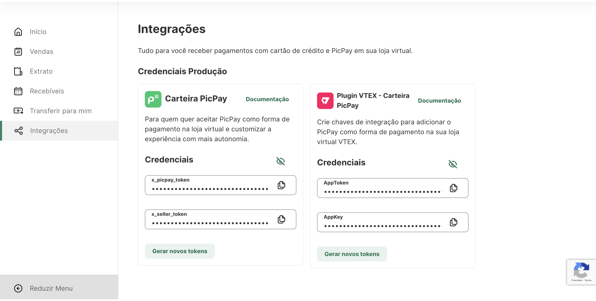
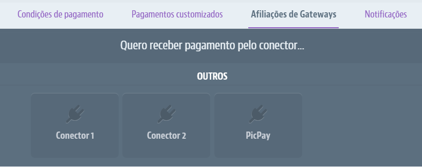

## Introdução

Neste guia vamos descrever o passo-a-passo para que você possa utilizar PicPay dentro do seu e-commerce com VTEX.

## Antes de começar

Antes de iniciar sua integração, você deve possuir credenciais válidas. Você pode conferir como obter suas credenciais [neste artigo](/checkout/intro/getting-started#antes-de-começar).

## Como utilizar

### Obtendo suas chaves de integração

Suas chaves de integração estarão disponíveis dentro do [painel lojista](https://lojista.picpay.com/ecommerce-token), no menu integrações.

Estas chaves deverão ser copiadas e inseridas dentro do seu painel de configuração da VTEX.

:::caution Atenção
Toda vez que novos tokens são gerados através do botão **Gerar Tokens**, os tokens antigos serão invalidados.
:::

### Habilitando o PicPay como forma de pagamento

Dentro de seu painel da VTEX, você deverá configurar o PicPay como um novo gateway de pagamentos.

**Passo 1** - Dentro da sessão de pagamentos, clique em **Congigurações**

**Passo 2** -Na aba Afiliações de Gateways, clique no botão +.

**Passo 3** -Selecionar o conector PicPay.

### Configurando suas chaves dentro da VTEX

Preencha os campos Application Key e Application Token com as informações da sua conta PicPay e salve as configurações.

## Próximos passos

- [Entenda os possíveis status de um pagamento](/checkout/guides/order-status);

## Obtendo ajuda
Esperamos ter ajudado com este artigo! Caso tenha restado alguma dúvida, você pode consultar o nosso FAQ ou entrar em contato através do e-mail relacionamento-empresas@picpay.com. 
