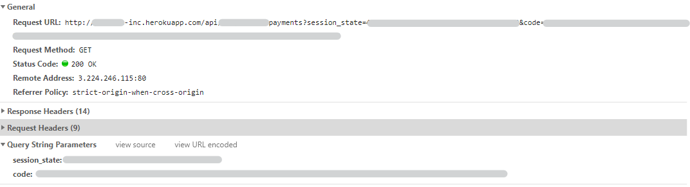

## About this guide

In this guide we will describe the step-by-step for you to obtain an access token to process online payments with PicPay by our logged payment solution.

## Before Starting

### Registro do aplicativo

Before starting your integration, you must have valid credentials. Currently for this product, the credentials creation process is done directly by the PicPay team

For this payment solution, the e-commerce must already be a PicPay partner. The data required to register the application are:
- Registration email;
- Redirect URL or callback URL;

:::info

The **PicPay 1-Click** solution is not available to all our merchants. Interested? Just contact us by email:  atrelationship-companies@picpay.com

:::

### Getting the `client_id` and `client_secret`

After registering the application, the PicPay will share the access credentials with the e-commerce in the form of a `client_id` and a `client_secret`.

#### More about the `client_id`

The ‘client ID’ is a publicly exposed string used by the service API to identify the application and also to create authorization URLs that are presented to users.

#### More About the `client_secret`

The client secret is used to authenticate the app's identity to the service API when the app requests access to a user's account, and should be kept private between the app and the API.

## How It works ?

The basic flow of authentication and authorization consists of generating a code after the user enters his login/password in a PicPay interface.

With the generated code, the e-commerce must generate a token that will be used in all `server to server` communication with PicPay. This token will allow the user to perform the following operations (depending on the configured scope):

- Process payments;
- Refund payments;
- Get user information;


### Redirecting user to login and password screen

Initially, your e-commerce should redirect your customers to the PicPay login and password page. For this, your e-commerce must generate the URL, whith your `client_id` and redirection url. Example:

```bash
curl --location --request GET 'https://api.picpay.com/oauth2/auth?client_id=xxxxxxxxxxxx&response_type=code&redirect_uri=http://yourwebsite.com/api/payments'

https://api.picpay.com/oauth2/auth?client_id=CLIENT_ID&response_type=code&redirect_uri=CALLBACK_URL&scope=scopes

```

Brief explanation of the above URL parameters:

- `client_id`: Application identifier provided by PicPay;
- `redirect_uri`: URL where the service redirects the user agent after granting an authorization code
- `response_type` Must be equal `code`, specifying that your application is requesting an authorization code grant

### Requesting user authorization

When using the URL from the [previous step](/one-click/guides/oauth2-flow#redirecionando-usuário-para-tela-de-login-e-senha), the client will be redirected to a login and password page. Your customer must have to login using his PicPay username and password.


After login, the customer must verify the permissions requested by the application.

:::info Information
The requested permissions will depend on the scope settings set when creating the credentials.
:::


:::caution Warning
The client may or may not grant permissions. Your application must be prepared to receive two types of response.

After the initial consent, PicPay will not ask the customer for permissions again.

:::

###Getting the authorization code

If the client authorizes the application in the [previous step](/one-click/guides/oauth2-flow#solicitando-a-autorização-do-usuário), the user will be redirected to the indicated return URL.

The authorization code will be sent as a parameter along with the indicated URL and must be used to generate tokens in the next step.



### Token request

In order to carry out requests for payment, reimbursement or querying information, the e-commerce must inform a valid token as one of the header parameters of each request.

The e-commerce must request an access token with the authorization code obtained in *step 3* and the `client_id` and `client_secret`.

Example token request:
```bash
curl -X POST \   
https://api.picpay.com/oauth2/token \  
-H "Content-Type='application/x-www-form-urlencoded'" \  
-d "grant_type=authorization_code" \  
-d "client_id=CLIENT_ID" \  
-d "code=AUTHORIZATION_CODE"  
-d "redirect_uri=REDIRECT_URI" 
``` 

If everything is ok, we will send the token as in the example below:
```json
{
  "access_token": "ACCESS_TOKEN",
  "expires_in": 300, // time in seconds
  "refresh_expires_in": 1800,
  "refresh_token": "REFRESH_TOKEN",
  "token_type": "bearer",
  "id_token": "ID_TOKEN",
  "not-before-policy": 1585954424,
  "session_state": "fa158d89-9228-45c6-8486-e159f28b5bd5",
  "scope": "openid email profile"
}
```

:::info Expiration time of a token

The token expiration time will be displayed in seconds. After expiration, the token must be refreshed using `refresh_token`.

The duration of the tokens can be configured in the creation and configuration of credentials by PicPay.

:::

### Updating the Tokens

After a predetermined period, the `access_token` granted to the application will expire, requiring a request for a new `access_token`. For this, a `refresh_token` is used, generated in the same request as the `access_token` (see Authentication and Authorization). Below is an example of a request:

```bash
curl -X POST \
https://api.picpay.com/oauth2/token \
-H "Content-Type='application/x-www-form-urlencoded'" \
-d "grant_type=refresh_token" \
-d "client_id=CLIENT_ID" \
-d "client_secret=CLIENT_SECRET" \
-d "refresh_token=REFRESH_TOKEN"
```

:::caution Token refresh flow

The token refresh flow must be provided in your application as the `refresh_token` will expire at some point. If the token is not updated, the user must login and password again.

:::

## Next Steps

With a valid `access_token`, your application will be able to make charges, refunds or consult some basic user information. Check the next steps below:

- [Making a charge](/one-click/guides/process-payments);
- [Requesting a refund](/one-click/guides/refund-payments);
- [Consulting user informations](/one-click/guides/user-info);


## Getting help

We hope this article has helped! If you have any questions, you can consult our FAQ or contact us by e-mail :  relacionamento-empresas@picpay.com. 

 


